## BTTH03: JS nền tảng, DOM & Sự kiện

**Đối tượng:** Sinh viên chưa học lý thuyết JavaScript

---
 
## 1. MỤC TIÊU HỌC TẬP

Sau buổi lab, sinh viên có thể:

- Mô tả được JavaScript là gì, chạy ở đâu, khác HTML/CSS ở điểm nào.
- Viết được các đoạn JS đơn giản với:
  - Biến, kiểu dữ liệu cơ bản (number, string, boolean),
  - Cú pháp lệnh, toán tử đơn giản,
  - Cấu trúc điều khiển if/else, vòng lặp đơn giản,
  - Hàm (function) có tham số và giá trị trả về.
- Thao tác được với DOM:
  - Lấy phần tử bằng `document.getElementById`,
  - Thay đổi nội dung văn bản, kiểu dáng (style),
  - Lắng nghe và xử lý một số sự kiện cơ bản: `click`, `input`.
- Nhận biết jQuery là một thư viện hỗ trợ thao tác DOM/sự kiện (ở mức nhận diện, chưa cần sử dụng thành thạo).

---

## 2. CẤU TRÚC THỜI GIAN BUỔI LAB
- 03 tiết thực hành.

---

## 3. HOẠT ĐỘNG 1 (45’): GIỚI THIỆU JS & CÚ PHÁP CƠ BẢN

### 3.1. Chuẩn bị file HTML & JS

Tạo file `lab-js-basic.html`:

```html
<!DOCTYPE html>
<html lang="vi">
<head>
  <meta charset="UTF-8">
  <title>Lab JS Cơ bản</title>
</head>
<body>
  <h1>Khám phá JavaScript</h1>
  <p id="welcome">Chưa có JavaScript...</p>
  <button id="runBtn">Nhấn để chạy JS</button>

  <script src="main.js"></script>
</body>
</html>
```

Tạo file `main.js`:

```js
console.log("Hello from JavaScript!");
```


---

### 3.2. Nhiệm vụ cho sinh viên

#### Bước 1: Mở file \& Quan sát bằng Console

1. Mở `lab-js-basic.html` trong trình duyệt (Chrome/Edge/…).
2. Mở DevTools → tab **Console**.
3. Quan sát thông báo xuất hiện.

> Câu hỏi:
> - Em thấy dòng thông báo nào trong console?\

--> Em thấy được trong tab Console có hiện thông báo `Hello from JavaScript!` 

> - Điều này cho em biết JavaScript đang làm gì khi trang web được tải?\
--> Nó cho ta biết rằng khi tải web, câu lệnh từ file `main.js` được thực thi bởi vì nó đã được nhúng vào file html
---

#### Bước 2:  “JavaScript là gì?” (Tra cứu nhanh)

Sử dụng 1–2 nguồn tài liệu (vd. W3Schools, freeCodeCamp, …), tóm tắt:

> a) JavaScript chạy ở đâu? (Trình duyệt / Server / Cả hai?) --> `Trình duyệt`
> b) HTML, CSS, JavaScript mỗi phần chịu trách nhiệm chính về điều gì?
>
> - HTML: `tạo khung xương cho trang web`
> - CSS: `trang trí cho trang web`
> - JavaScript: `tạo chuyển động, tương tác của người dùng đối với trang web`

---

#### Bước 3: Thử nghiệm biến \& kiểu dữ liệu trong Console

Trong tab Console, gõ từng dòng sau và ghi lại kết quả:

```js
let age = 20;
const name = "An";
let isStudent = true;

typeof age;
typeof name;
typeof isStudent;

1 + 2 * 3;
"Hello " + "world";
```

> Câu hỏi:

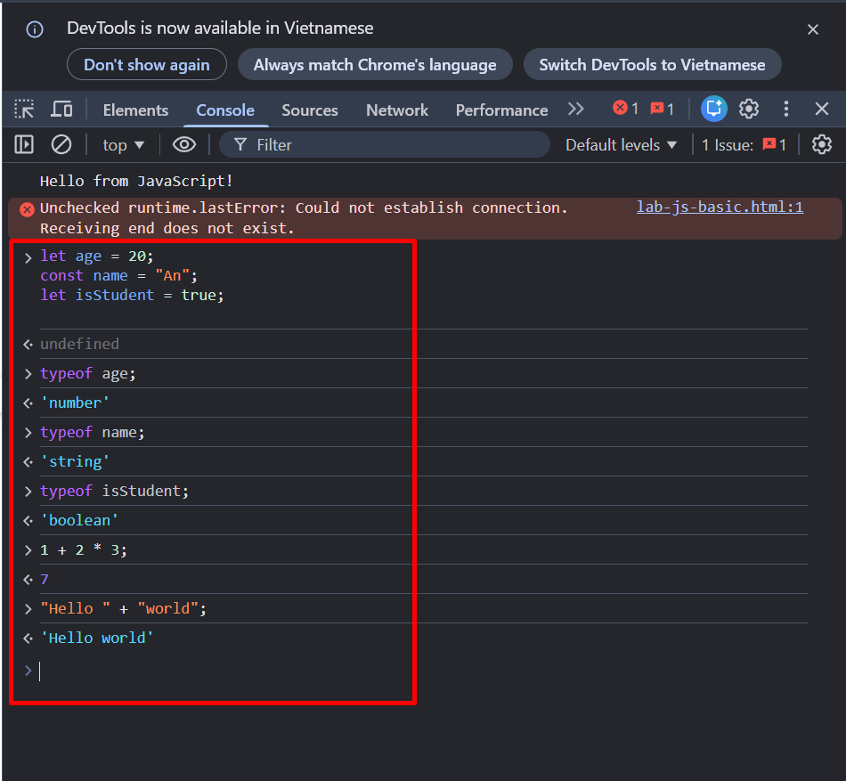

> - Kết quả `typeof age` là gì? --> `number`
> - Kết quả `typeof name` là gì? --> `string`
> - Kết quả `typeof isStudent` là gì? --> `boolean`
> - Em hãy tự mô tả ngắn gọn:
>   - `number` là: `số`
>   - `string` là: `chuỗi`
>   - `boolean` là: `logic`

---

#### Bước 4: Viết đoạn script tính tuổi

Mở file `main.js`, viết thêm:

```js
let name = "An";
let yearOfBirth = 2005;
let currentYear = 2026;
let age = currentYear - yearOfBirth;

console.log("Xin chào, mình là " + name + ", năm nay mình " + age + " tuổi.");
```

Sau đó:

1. Đổi giá trị `name`, `yearOfBirth` thành thông tin của chính em.

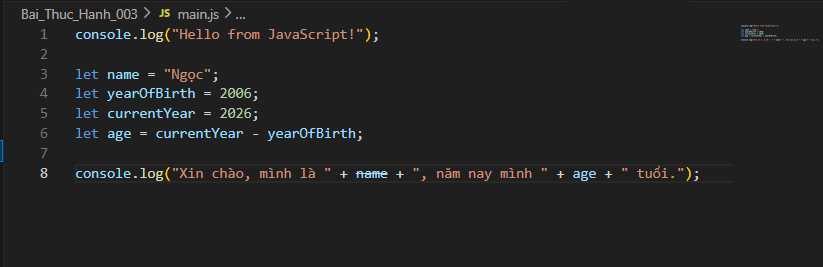

2. Reload trang \& quan sát console.

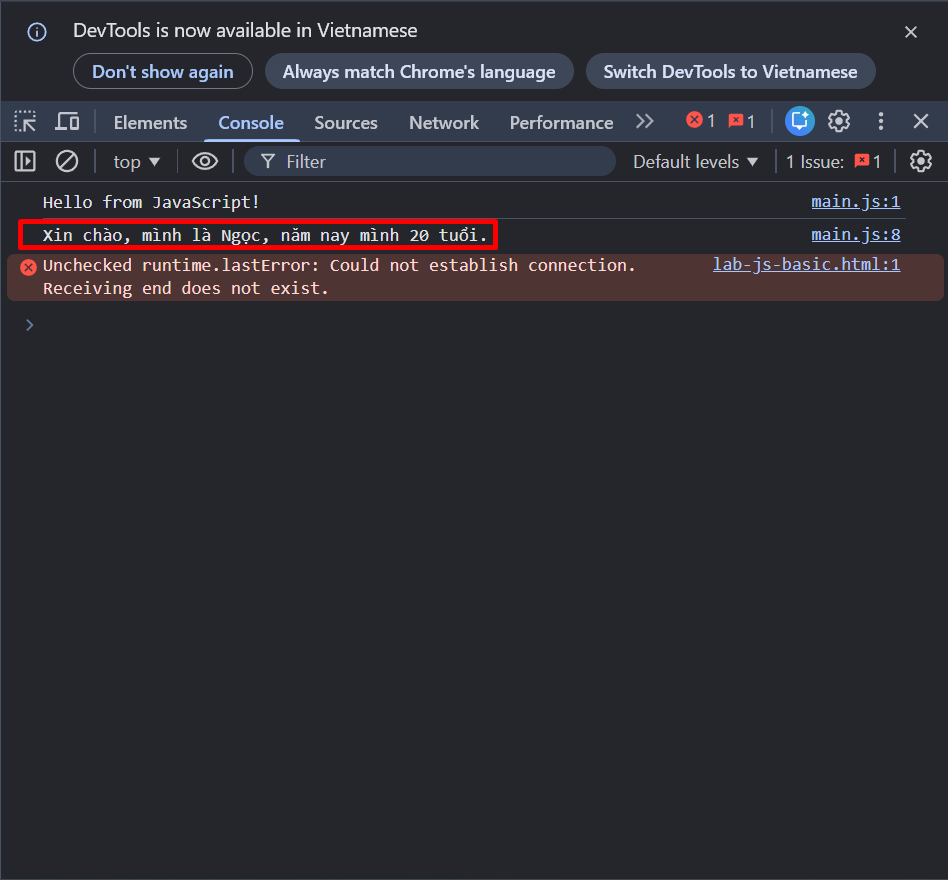

> Câu hỏi:
> - Dòng log hiển thị gì sau khi em sửa thông tin?\
--> `Hiện thị chính thông tin vừa chỉnh sửa`

> - Nếu em quên dấu `;` hoặc quên dấu `+`, điều gì xảy ra? Trình duyệt báo lỗi thế nào?
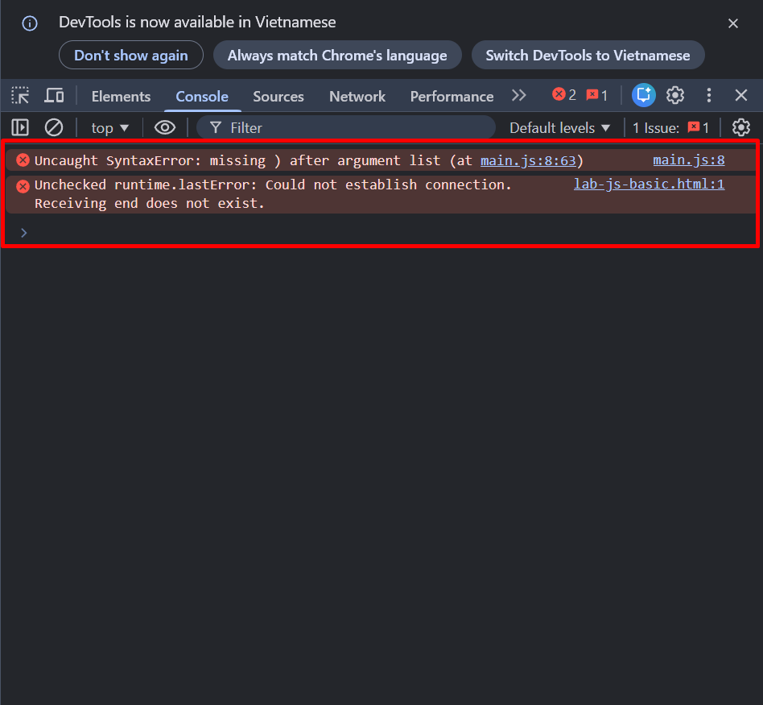
--> `Báo lỗi cú pháp`
---

#### Bước 5: Phản tư nhanh (Reflection)

> - Điều thú vị nhất em vừa khám phá được về console là gì?\
--> `Nó như terminal, được tích hợp để compile JS`

> - Em gặp lỗi cú pháp nào? Em đã xử lý bằng cách nào (tự sửa, hỏi bạn, đọc lỗi, tìm Google, …)?
--> `Dịch nếu hiểu thì tự sửa còn không sửa được thì dùng AI hoặc tra GG`
---

## 4. HOẠT ĐỘNG 2 (40’): CẤU TRÚC ĐIỀU KHIỂN \& HÀM

### 4.1. Chuẩn bị file logic (hoặc viết tiếp trong main.js)

Ví dụ đoạn mã:

```js
// TODO: Đổi giá trị score và quan sát kết quả
let score = 7.5;

// TODO: Dự đoán điều kiện if/else đang làm gì, rồi chạy thử
if (score >= 8) {
  console.log("Giỏi");
} else if (score >= 6.5) {
  console.log("Khá");
} else if (score >= 5) {
  console.log("Trung bình");
} else {
  console.log("Yếu");
}

// TODO: Viết hàm tính điểm trung bình 3 môn
function tinhDiemTrungBinh(m1, m2, m3) {
  let avg = (m1 + m2 + m3) / 3;
  return avg;
}

// Gợi ý dùng thử hàm trong console:
// tinhDiemTrungBinh(8, 7, 9);
```

**Chạy thử**
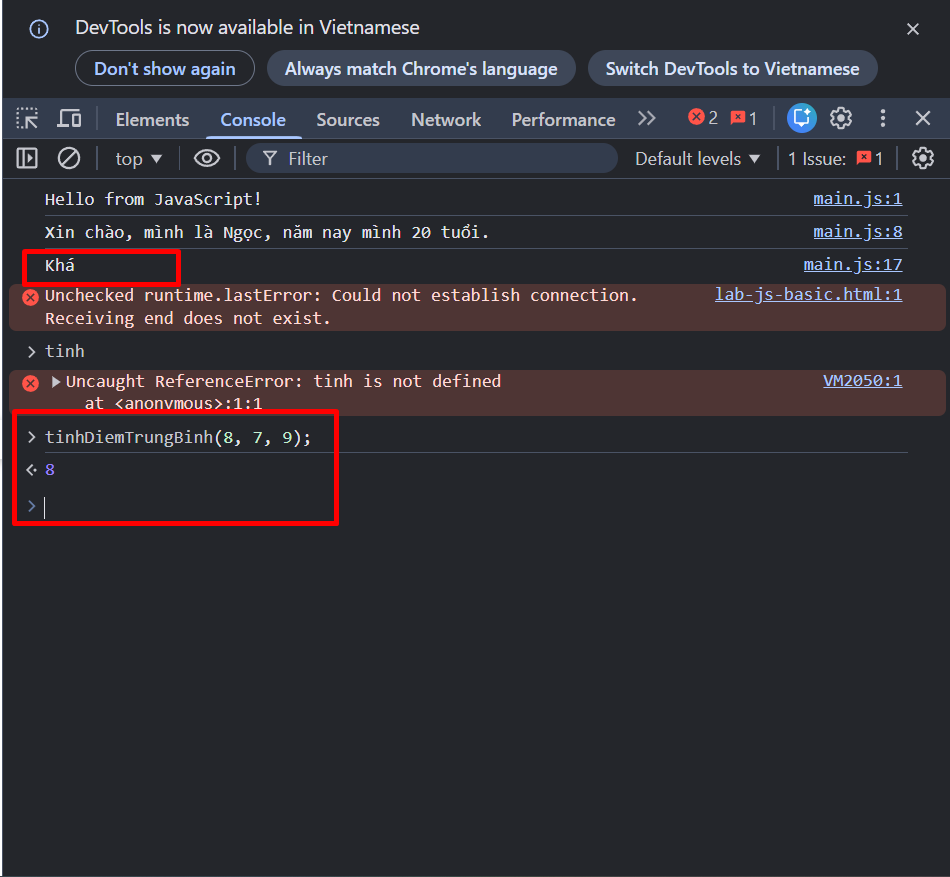

---

### 4.2. Nhiệm vụ cho sinh viên

#### Bước 1: Đoán trước – chạy sau

> a) Nếu `score = 9`, em dự đoán console sẽ in: `Giỏi`
> b) Nếu `score = 6`, em dự đoán console sẽ in: `Trung bình`

Sau đó:

1. Thay `score = 9`, reload trang hoặc chạy file và kiểm tra console.
2. Thay `score = 6`, kiểm tra lại.

> So sánh dự đoán và kết quả thực tế:
> - Trường hợp `score = 9`: Dự đoán vs Thực tế: `Đúng`
> - Trường hợp `score = 6`: Dự đoán vs Thực tế: `Đúng`

---

#### Bước 2: Mô tả lại if/else bằng lời

> - Khi nào chương trình in `"Giỏi"`? --> `Khi biến 'score' lớn hơn hoặc bằng 8`
> - Khi nào chương trình in `"Yếu"`? --> `Khi biến 'score' nhỏ hơn 5`
> - Em hãy mô tả cấu trúc `if/else` bằng lời của em (có thể ví von “ngã rẽ” trong đời sống):

--> `Ví dụ chơi trò mê cung, điều kiện là đi vào đường cụt thì quay lại đi hướng khác, nếu tìm thấy đích thì được coi là thắng`

---

#### Bước 3: Làm việc với hàm

1. Mở Console, gọi hàm:
```js
tinhDiemTrungBinh(8, 7, 9);
```

> Em ghi lại giá trị hàm trả về: `8`

2. Viết thêm hàm `xepLoai(avg)` trong file JS:
```js
function xepLoai(avg) {
    if (avg >= 8) {
      return "Giỏi";
    } else if (avg >= 6.5) {
      return "Khá";
    } else if (avg >= 5) {
      return "Trung bình";
    } else {
      return "Yếu";
    }
}
```


3. Gọi thử trong console:
```js
let avg = tinhDiemTrungBinh(8, 7, 9);
let loai = xepLoai(avg);
console.log("Điểm TB:", avg, " - Xếp loại:", loai);
```
<br>

**Chạy thử trong console**
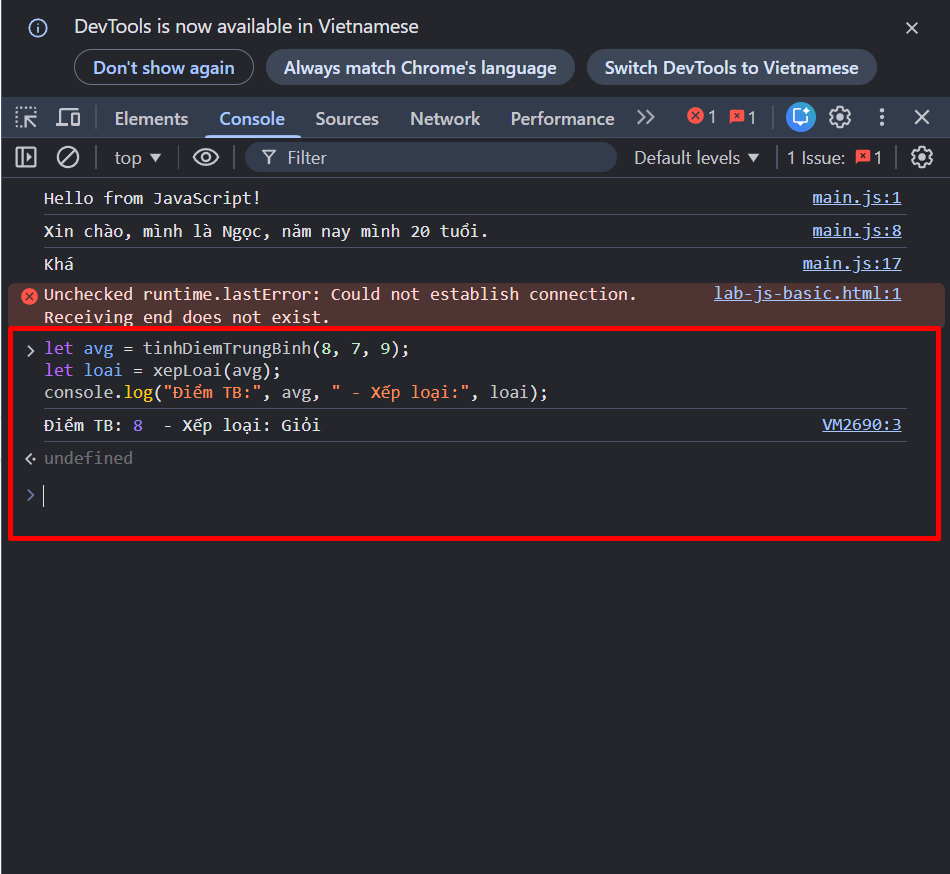
<br>
> Câu hỏi:
> - Một hàm gồm những phần chính nào?
>   - Tên hàm: `tên hàm, biến tham số, biểu thức(hành động của hàm), giá trị trả về`
>   - Tham số (parameters): `là 1 biến truyền vào hàm, làm nguyên liệu cho hàm thực hiện hành động`
>   - Thân hàm (body): `hành động, một tập hợp các hành động của hàm tác động lên tham số(nêu có)`
>   - Giá trị trả về (return): `kết quả của hành động được trả về`
> - Ưu điểm của việc dùng hàm thay vì lặp lại cùng một đoạn code nhiều lần là gì?
```
- Có thể tái sử dụng nhiều lần
- Có thể sửa đổi một cách dễ dàng, không cần phải sửa ở từng nơi
```
---

#### Bước 4: Mở rộng nhỏ (tuỳ chọn)

Viết hàm `kiemTraTuoi(age)`:

```js
function kiemTraTuoi(age) {
  // TODO:
  // Nếu age >= 18 -> console.log("Đủ 18 tuổi");
  // Ngược lại -> console.log("Chưa đủ 18 tuổi");
    if (age >= 18) {
        console.log("Đủ 18 tuổi");
    } else {
        console.log("Chưa đủ 18 tuổi");
    }
}
```
<br>

Gọi thử: `kiemTraTuoi(16);`, `kiemTraTuoi(20);`.

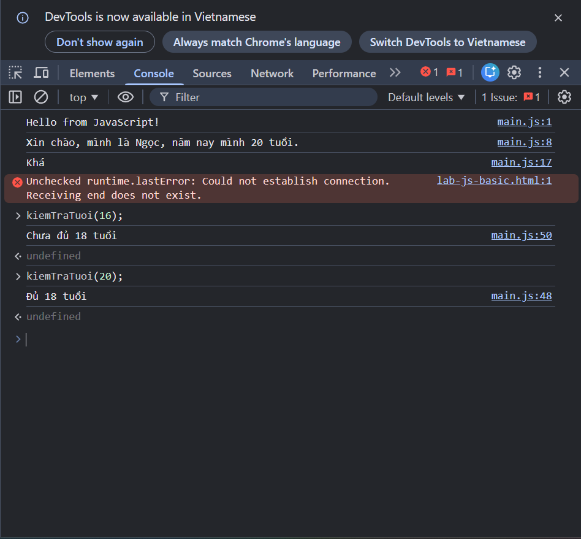
---

#### Bước 5: Phản tư

> - Phần nào trong if/else hoặc hàm khiến em khó hiểu nhất?
> - Em đã làm gì để vượt qua (thử nhiều lần, hỏi bạn, xem lại ví dụ, tra Google, …)?

---

## 5. HOẠT ĐỘNG 3 (40’): THAO TÁC DOM \& SỰ KIỆN

### 5.1. Chuẩn bị HTML

Thêm vào trang (hoặc tạo file mới):

```html
<section>
  <h2>DOM & Sự kiện</h2>
  <p id="status">Chưa có tương tác...</p>

  <button id="btnHello">Chào</button>
  <button id="btnRed">Đổi màu nền thành đỏ</button>

  <div style="margin-top: 20px;">
    <label>Nhập tên: </label>
    <input id="nameInput" type="text" />
    <p id="greeting"></p>
  </div>
</section>

<script src="dom.js"></script>
```

Tạo file `dom.js`:

```js
const statusEl = document.getElementById("status");
const btnHello = document.getElementById("btnHello");

btnHello.addEventListener("click", function () {
  statusEl.textContent = "Xin chào! Đây là nội dung được thay đổi bằng JavaScript.";
});
```


---

### 5.2. Nhiệm vụ cho sinh viên

#### Bước 1: Đọc \& giải thích

> Câu hỏi:
> - `document.getElementById("status")` đang làm gì?\
--> `Lấy element có ID là status và gán vào biến statusEl`

> - Sự kiện `"click"` xảy ra khi nào?\
--> `Khi click vào nút Chào`

> - Trong đoạn code trên, khi nhấn nút `btnHello`, điều gì thay đổi trên trang?\
--> `Đổi thành dòng chữ "Xin chào! Đây là nội dung được thay đổi bằng JavaScript."`

---

#### Bước 2: Thử nghiệm nút đổi màu nền

Hoàn thiện code:

```js
const btnRed = document.getElementById("btnRed");

btnRed.addEventListener("click", function () {
  // TODO: Đổi màu nền trang thành đỏ
  document.body.style.backgroundColor = "red";
});
```

**Chạy thử**
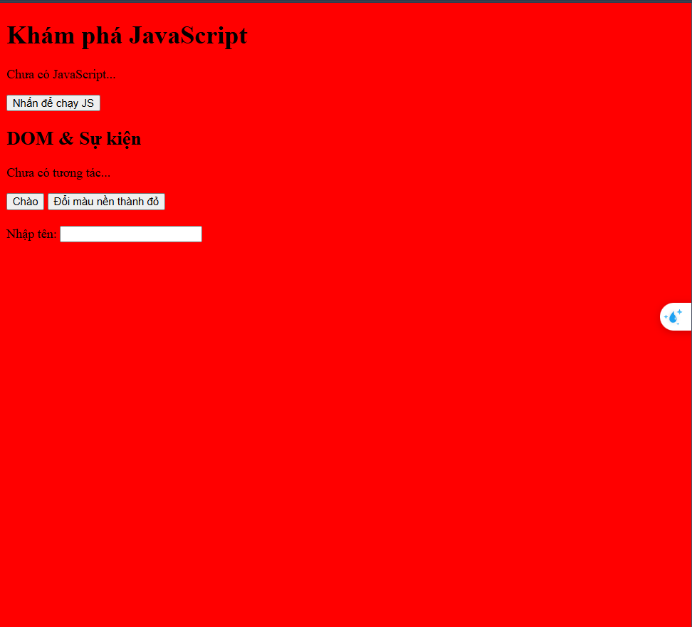

> Câu hỏi:
> - Em có thể đổi sang màu khác (vd. `lightblue`) không? Hãy thử.
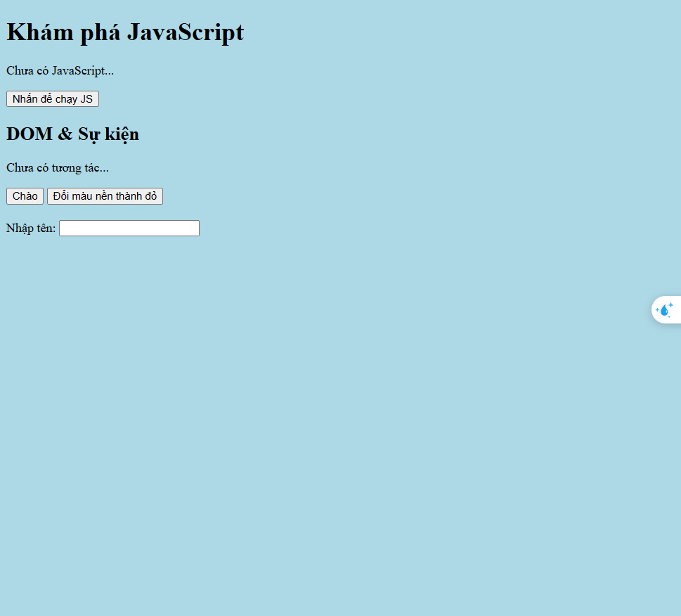

> - Em hãy ghi lại 1 ví dụ khác mà JavaScript có thể làm với `document.body.style`.
`document.body.style.display = "none";`\
`--> Ẩn toàn bộ nội dung khi ấn nút`


---

#### Bước 3: Xử lý sự kiện input – gõ tên, hiện lời chào

Hoàn thiện code:

```js
const nameInput = document.getElementById("nameInput");
const greeting = document.getElementById("greeting");

nameInput.addEventListener("input", function () {
  const value = nameInput.value;
  greeting.textContent = "Xin chào, " + value + "!";
});
```

> Câu hỏi:
> - Sự kiện `"input"` khác gì so với `"click"`?\
`--> Nhập input vào thì nó tự động in ra, còn click cần phải tương tác kich chuột vào nút `

> - Khi em xoá hết nội dung ô input, dòng `greeting` hiển thị gì?\
--> `Vãn hiển thị dòng "Xin chào, !"`

---

#### Bước 4: Liên hệ khái niệm DOM

> DOM (Document Object Model) là mô hình biểu diễn trang HTML dưới dạng một **cây các đối tượng** mà JavaScript có thể truy cập và thay đổi.
>
> Em hãy:
> - Tự mô tả DOM bằng lời của em:
>   ................................................................
> - Nêu 1 ví dụ “thao tác DOM” trong bài (ghi lại 1 dòng lệnh cụ thể).

---

#### Bước 5: Ảnh kết quả

Hãy chụp các ảnh màn hình:

1. Khi vừa tải trang (chưa tương tác).
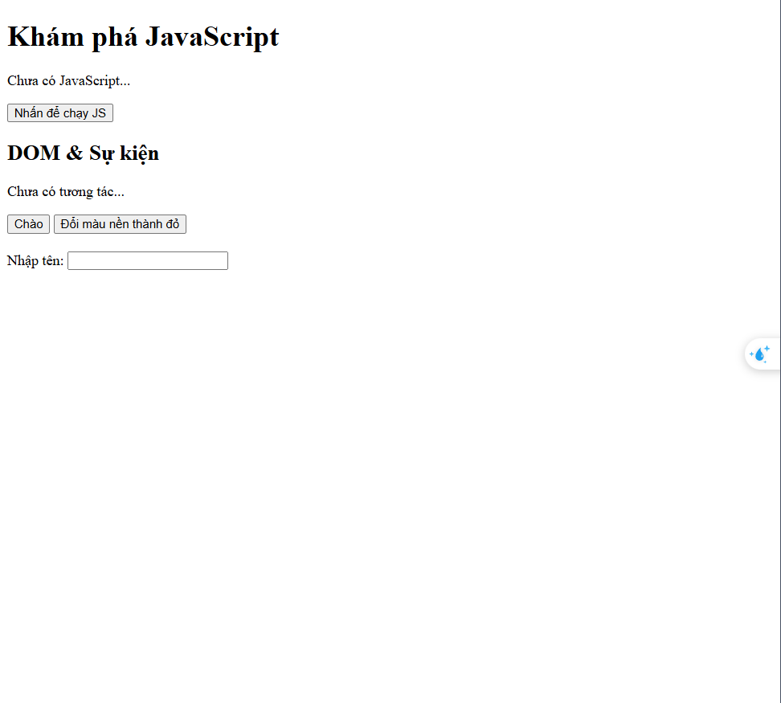

2. Sau khi nhấn “Chào”.
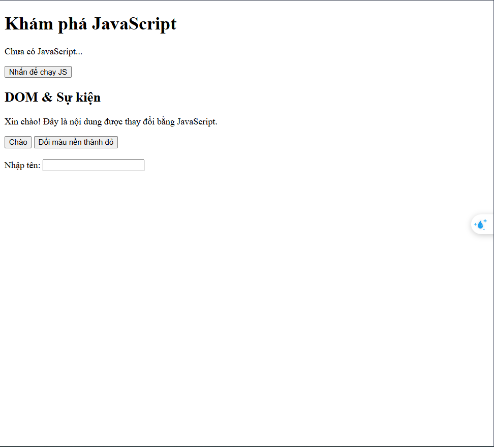

3. Sau khi đổi nền sang màu đỏ.
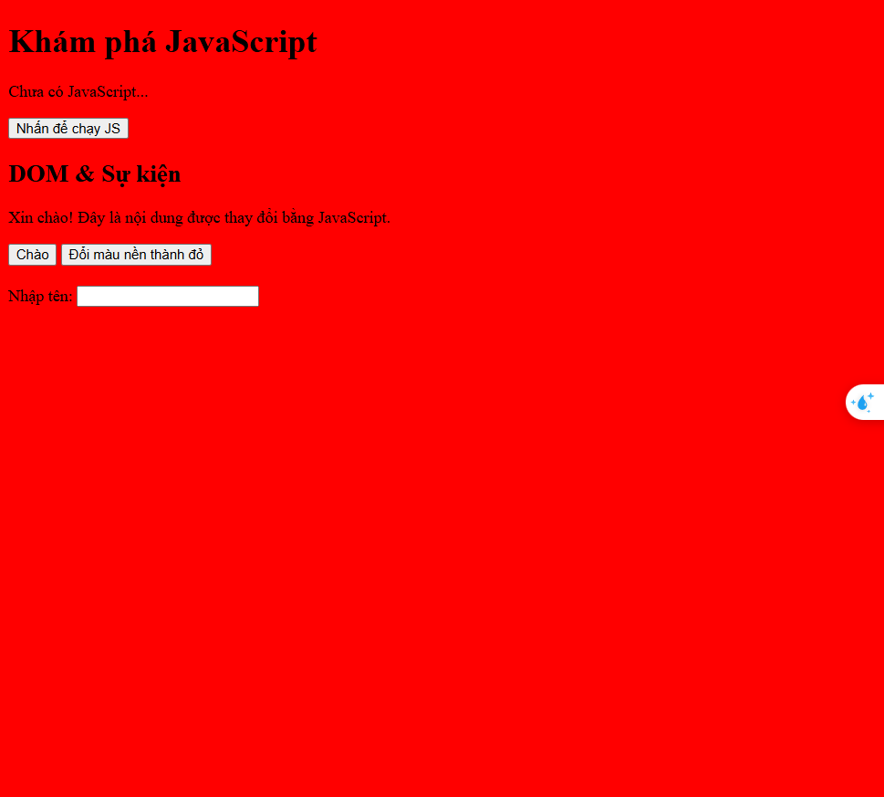

4. Khi gõ tên và nhìn thấy lời chào xuất hiện.
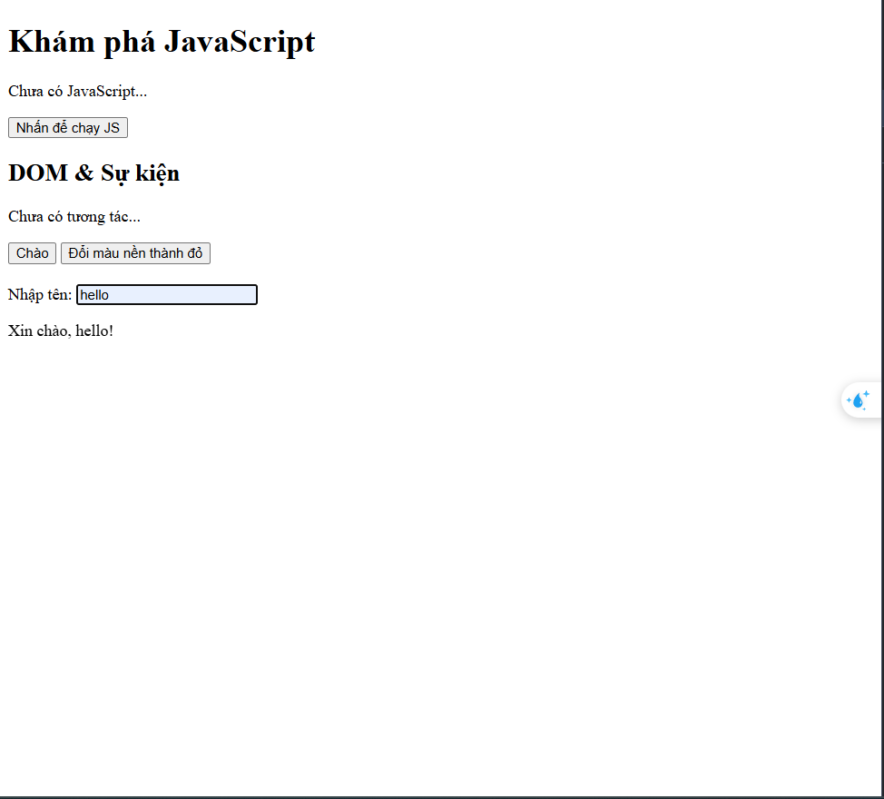

*(Ảnh có thể được yêu cầu nộp cùng bài hoặc dán vào báo cáo)*

---

## 6. KẾT THÚC (15’): GIỚI THIỆU JQUERY \& PHẢN TƯ

### 6.1. Nhìn nhanh jQuery (so sánh với JS thuần)

Ví dụ:

```js
// JS thuần
document.getElementById("btnHello").addEventListener("click", function () {
  alert("Hello from JS!");
});

// jQuery (giả sử đã import jQuery)
$("#btnHello").on("click", function () {
  alert("Hello from jQuery!");
});
```

> Câu hỏi:
> - Điểm giống nhau về chức năng giữa 2 đoạn code trên là gì?
```
- Đều tìm kiểm element có ID là btnHello
- Đều mở hộp thoại alert Hello from JS
```

> - Điểm khác nhau về cú pháp là gì (`document.getElementById` vs `$("#id")`, `addEventListener` vs `.on`)?

--> `So sánh`:
|Thao tác|JS  |jQuery  |
|---------|---------|---------|
|**Chọn phần tử**     | `document.getElementById("btnHello")`: Dùng phương thức chính thống của DOM, cú pháp dài dòng nhưng tốc độ thực thi nhanh nhất        |`$("#btnHello")`: Sử dụng bộ chọn (selector) giống CSS. Cú pháp cực kỳ ngắn gọn và dễ đọc.         |
|**Gán sự kiện**   | `.addEventListener("click", ...)`: Là phương thức chuẩn hóa của W3C, cho phép gán nhiều hàm xử lý cho cùng một sự kiện| `.on("click", ...)`: Một phương thức đa năng của jQuery, không chỉ ngắn hơn mà còn hỗ trợ tốt cho việc xử lý các phần tử được tạo ra động sau này|


<br>

> - Em hãy tra cứu nhanh “What is jQuery used for?” và ghi 2 ý chính:
>   1. `Đơn giản hóa việc thao tác DOM và xử lý sự kiện: jQuery giúp việc chọn các phần tử HTML, thay đổi nội dung, CSS hoặc gán sự kiện trở nên dễ dàng hơn rất nhiều so với JS thuần (viết ít hơn, làm được nhiều hơn)`
>   2. `Tương thích đa trình duyệt (Cross-browser compatibility): jQuery tự động xử lý các khác biệt về kỹ thuật giữa các trình duyệt (như Chrome, Firefox, IE cũ), giúp lập trình viên viết code một lần mà vẫn chạy ổn định ở mọi nơi.`

---

### 6.2. Tự đánh giá \& định hướng

> 1. Sau buổi lab, em tò mò nhất về phần nào của JavaScript/DOM?
> 2. Em muốn tự làm thêm tính năng gì trên trang web (vd: bộ đếm, đổi theme, pop-up, mini game, …)?
> 3. Em đánh giá mức độ hiểu của mình về:
>    - Biến \& kiểu dữ liệu: [ ] Chưa hiểu  [ ] Tạm ổn  [ ] Khá rõ
>    - If/else \& hàm:       [ ] Chưa hiểu  [ ] Tạm ổn  [ ] Khá rõ
>    - DOM \& sự kiện:       [ ] Chưa hiểu  [ ] Tạm ổn  [ ] Khá rõ

---

## 7. GHI CHÚ CHO GIẢNG VIÊN (NỘI BỘ)

- Có thể cho SV làm theo cặp/nhóm 2–3 để hỗ trợ nhau thử nghiệm, đọc lỗi, tra cứu.
- Tùy thời lượng thực tế, có thể:
    - Giảm bớt phần mở rộng (hàm `kiemTraTuoi`, tuỳ biến thêm hiệu ứng).
    - Hoặc tăng thêm bài tập DOM (ẩn/hiện một khối, đếm số lần click, v.v.).
- Phiếu học tập tiếp theo có thể chi tiết hóa từng hoạt động thành form trả lời, chỗ dán ảnh, và câu hỏi mini test trắc nghiệm.

```

---```

